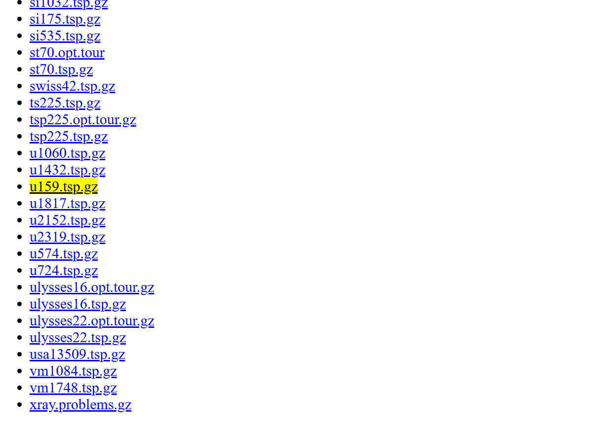
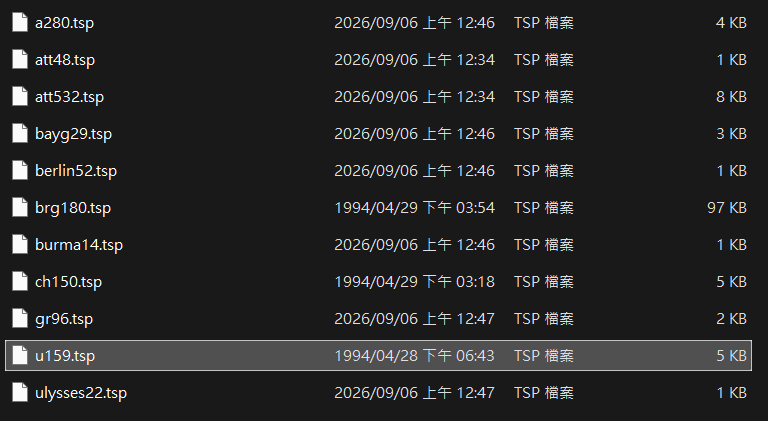
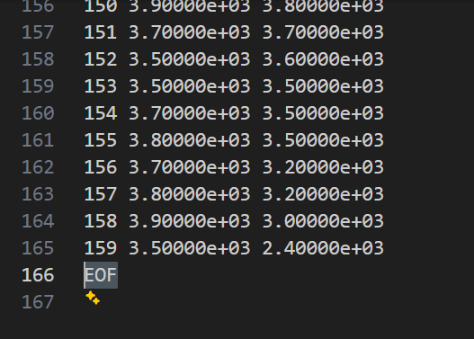
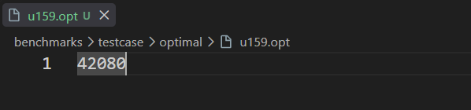

# Benchmarks

The benchmarks use TSP instances from [TSPLIB](https://comopt.ifi.uni-heidelberg.de/software/TSPLIB95/index.html), with the [tsplib95](https://github.com/rhgrant10/tsplib95) package for parsing problem data.  
To keep the repository lightweight, only 10 representative test cases are included.

## Structure
```text
benchmarks/
│
├── results/          # Benchmark results
│   ├── {problem-1}/   # Results for problem 1
│   ├── {problem-2}/   # Results for problem 2
│   ...
│   └── {problem-k}/  # Results for problem k
├── testcase/
│   ├── optimal/      # Optimal solutions for test cases
│   └── problems/     # TSPLIB problem instances
├── algos_bench.py    # Benchmark runner
└── Benchmarks.md
```

## Running benchmarks

After installing the required dependencies as described in the [README](../README.md), run:

```bash
# Run all algorithms 
$ python ./benchmarks/algos_bench.py all

## Run the specific algorithm
$ python ./benchmarks/algos_bench.py christofides
$ python ./benchmarks/algos_bench.py double_tree
$ python ./benchmarks/algos_bench.py nearest_addition
$ python ./benchmarks/algos_bench.py nearest_neighbor
```

## Results

The benchmark results are printed to the command line:

```txt
Running DoubleTreeAlgo on 10 problem(s)...
[   a280   ] distance =      3565.00, optimal =    2579.00, ratio = 1.3823, time =  0.0669s
[  att48   ] distance =     13925.00, optimal =   10628.00, ratio = 1.3102, time =  0.0019s
[  att532  ] distance =     37155.00, optimal =   27686.00, ratio = 1.3420, time =  0.6856s
[  bayg29  ] distance =      2210.00, optimal =    1610.00, ratio = 1.3727, time =  0.0034s
[ berlin52 ] distance =     10114.00, optimal =    7542.00, ratio = 1.3410, time =  0.0075s
[  brg180  ] SKIPPED (classified as TSP, not MetricTSP)
[ burma14  ] distance =      3814.00, optimal =    3323.00, ratio = 1.1478, time =  0.0005s
[  ch150   ] distance =      8413.00, optimal =    6528.00, ratio = 1.2888, time =  0.0581s
[   gr96   ] distance =     75301.00, optimal =   55209.00, ratio = 1.3639, time =  0.0255s
[ulysses22 ] distance =      8401.00, optimal =    7013.00, ratio = 1.1979, time =  0.0015s

Done. Reports saved under: C:\...\Python-Metric-TSP\benchmarks\results
```

After the benchmark completes, detailed reports for each problem and algorithm are saved in the `results/` folder.

For example:

```txt
┌─────────────────────────────────────────────────────────────┐
│ Problem   : bayg29                                          │
│ TSP_Type  : MetricTSP                                       │
│ Algorithm : ChristofidesAlgo                                │
│ Distance  : 1737.0000                                       │
│ Optimal   : 1610.0000                                       │
│ Ratio     : 1.0789                                          │
│ Time      : 0.0102s                                         │
├─────────────────────────────────────────────────────────────┤
│ Tour:                                                       │
│  1 —→ 28 —→  6 —→ 12 —→  5 —→  9 —→  3 —→ 29 —→ 26 —→ 21 —→ │
│  2 —→ 20 —→ 10 —→ 13 —→  4 —→ 15 —→ 18 —→ 14 —→ 22 —→ 17 —→ │
│ 11 —→ 19 —→ 25 —→  7 —→ 23 —→ 27 —→  8 —→ 16 —→ 24 —→ 1     │
└─────────────────────────────────────────────────────────────┘
```

## How to add a new test case

First, download the desired test case from [TSPLIB TSP](https://comopt.ifi.uni-heidelberg.de/software/TSPLIB95/tsp/tspindex.html). This example uses `u159`.



After downloading and extracting the archive, place `u159.tsp` in `testcase/problems/`.




Remove the EOF line from `u159.tsp` so that it can be parsed correctly by `tsplib95`.



Next, create `u159.opt` in `testcase/optimal/`. Find the optimal solution for `u159` on [TSPLIB Optimal Solutions](https://comopt.ifi.uni-heidelberg.de/software/TSPLIB95/tsp/TSP-BEST.html) and put it in `u159.opt`.




Finally, run the desired benchmark algorithm:

```bash
$ python ./benchmarks/algos_bench.py christofides
```

The new test case should then appear in the benchmark results:

```txt
Running ChristofidesAlgo on 11 problem(s)...
[   a280   ] distance =      2816.00, optimal =    2579.00, ratio = 1.0919, time =  1.1898s
[  att48   ] distance =     11441.00, optimal =   10628.00, ratio = 1.0765, time =  0.0407s
[  att532  ] distance =     30713.00, optimal =   27686.00, ratio = 1.1093, time =  7.4917s
[  bayg29  ] distance =      1737.00, optimal =    1610.00, ratio = 1.0789, time =  0.0139s
[ berlin52 ] distance =      8229.00, optimal =    7542.00, ratio = 1.0911, time =  0.0248s
[  brg180  ] SKIPPED (classified as TSP, not MetricTSP)
[ burma14  ] distance =      3448.00, optimal =    3323.00, ratio = 1.0376, time =  0.0015s
[  ch150   ] distance =      7075.00, optimal =    6528.00, ratio = 1.0838, time =  0.2147s
[   gr96   ] distance =     59403.00, optimal =   55209.00, ratio = 1.0760, time =  0.1029s
[   u159   ] distance =     45664.00, optimal =   42080.00, ratio = 1.0852, time =  0.2496s
[ulysses22 ] distance =      7448.00, optimal =    7013.00, ratio = 1.0620, time =  0.0053s

Done. Reports saved under: C:\...\Python-Metric-TSP\benchmarks\results
```

```
┌───────────────────────────────────────────────────────────────────────┐
│ Problem   : u159                                                      │
│ TSP_Type  : MetricTSP                                                 │
│ Algorithm : ChristofidesAlgo                                          │
│ Distance  : 45664.0000                                                │
│ Optimal   : 42080.0000                                                │
│ Ratio     : 1.0852                                                    │
│ Time      : 0.2496s                                                   │
├───────────────────────────────────────────────────────────────────────┤
│ Tour:                                                                 │
│   1 —→ 159 —→   2 —→   4 —→   5 —→ 153 —→ 152 —→   7 —→   8 —→   9 —→ │
│  10 —→  11 —→  13 —→  14 —→  15 —→  16 —→  17 —→  18 —→  19 —→  20 —→ │
│  21 —→  23 —→  22 —→  24 —→  25 —→  27 —→  26 —→  28 —→  29 —→  30 —→ │
│  31 —→  32 —→  33 —→  34 —→  35 —→  36 —→  38 —→  39 —→  40 —→  41 —→ │
│  42 —→  43 —→  44 —→  45 —→  46 —→  47 —→  48 —→  49 —→  50 —→  51 —→ │
│  52 —→  75 —→  74 —→  76 —→  77 —→  73 —→  71 —→  70 —→  69 —→  68 —→ │
│  67 —→  66 —→  65 —→  64 —→  62 —→  61 —→  60 —→  59 —→  58 —→  57 —→ │
│  56 —→  55 —→  53 —→  54 —→  63 —→  72 —→  78 —→  79 —→  80 —→  81 —→ │
│  82 —→  83 —→  84 —→  85 —→  86 —→  97 —→  98 —→  99 —→ 100 —→ 101 —→ │
│ 102 —→ 103 —→ 104 —→ 105 —→ 106 —→ 107 —→  95 —→  96 —→  87 —→  88 —→ │
│  89 —→  94 —→  90 —→  91 —→  92 —→  93 —→ 119 —→ 120 —→ 121 —→ 122 —→ │
│ 123 —→ 114 —→ 115 —→ 116 —→ 117 —→ 118 —→ 109 —→ 108 —→ 110 —→ 111 —→ │
│ 112 —→ 113 —→ 125 —→ 126 —→ 127 —→ 128 —→ 129 —→ 124 —→ 130 —→ 131 —→ │
│ 132 —→ 134 —→ 133 —→ 136 —→ 135 —→  37 —→ 138 —→ 137 —→ 139 —→ 140 —→ │
│ 141 —→ 142 —→ 143 —→ 144 —→ 145 —→  12 —→ 146 —→ 147 —→ 149 —→ 148 —→ │
│ 150 —→ 151 —→   6 —→ 154 —→ 155 —→ 158 —→ 157 —→ 156 —→   3 —→ 1      │
└───────────────────────────────────────────────────────────────────────┘
```

## Notes

Although `EUC_2D` represents Euclidean distances, TSPLIB rounding may cause some instances to violate the triangle inequality. These instances are still treated as Metric TSP instances in this project. For details about the TSPLIB data format, please refer to [`docs/tsp95.pdf`](../docs/tsp95.pdf).
